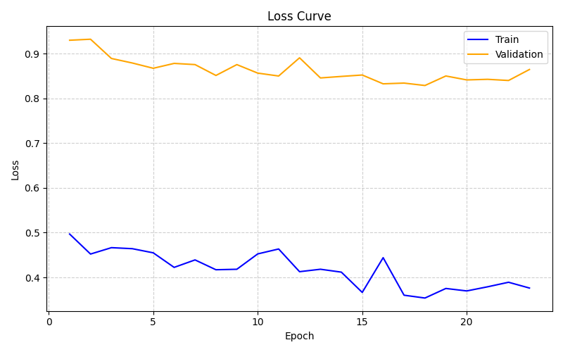
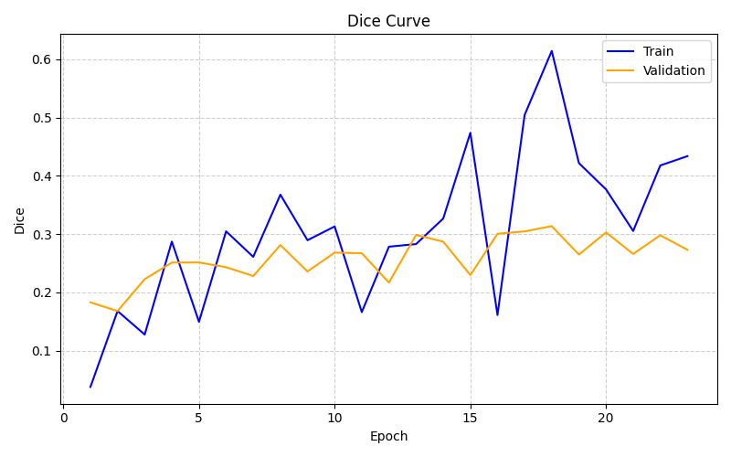
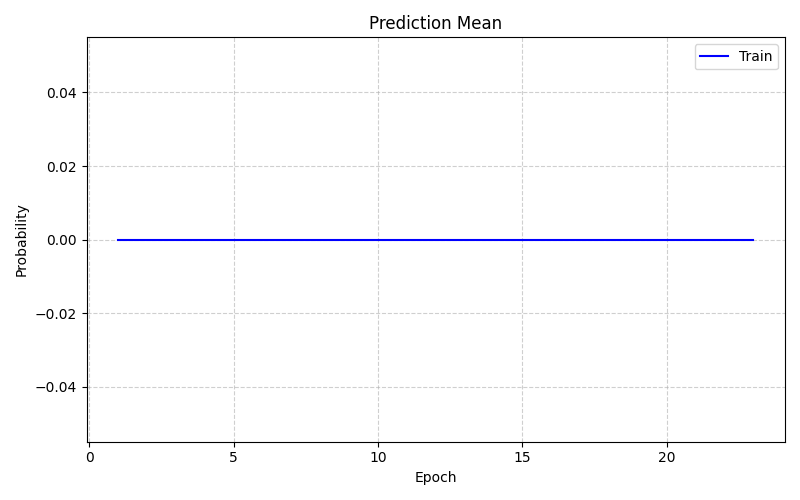

# HybridMedNeXt++ Experiment Report

## Overview
- **Experiment**: experiment
- **Framework Version**: 1.0.0
- **Start Time**: 2026-07-12 12:09:29

## Hardware & Environment
- **GPU**: NVIDIA H100 80GB HBM3
- **CUDA**: 12.4
- **PyTorch**: 2.6.0+cu124
- **Git Commit**: aaaa6d2bc1663c5f8fafb19b17cc85058b0e68d5

## Results
- **Best Validation Dice**: 0.3138044399920368
- **Best Epoch**: 18
- **Checkpoint Path**: `outputs/2026-07-12_12-09-24/checkpoints/best.pt`

## Training Curves




## Configuration Snapshot
```yaml
# Please refer to configs/ in the output directory
```
